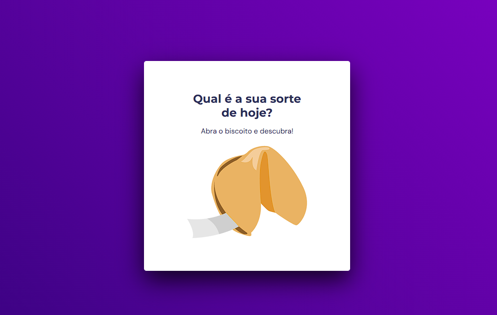

<h1 align="center"> Biscoito da sorte </h1>

Clicar no biscoito para ver sua sorte!  

  

## 🚀 Tecnologias

Esse projeto foi desenvolvido com as seguintes tecnologias:

- HTML e CSS
- JavaScript
- Git e Github
- Figma

## 💻 Projeto

O projeto Biscoito da sorte tem como intuito exercitar o uso de lógica de programação, variáveis, eventos e callbacks. Além do uso de @Keyframes para animações CSS.

- [Acesse o projeto finalizado, online](https://matheusalm0.github.io/FortuneCookie/)
---

